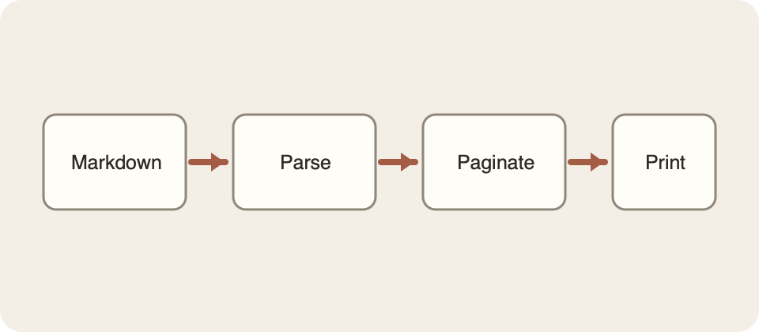

# Start with the boundary

Good architecture is less about drawing boxes and more about deciding where uncertainty is allowed to live. This fixture exercises **bold text**, _emphasis_, ~~removed ideas~~, [useful links](https://example.com), and `inline code`.

> [!NOTE]
> The smallest dependable interface is usually the best one.

## Principles

- Keep inputs explicit.
- Make failure visible.
  - Recover locally when possible.
  - Preserve the user's work.
- Prefer boring data structures.

1. Observe the workflow.
2. Name the boundary.
3. Test the contract.

- [x] Parse the source
- [x] Render the page
- [ ] Ship the next refinement

## Operational profile

| Concern    |       Signal | Response                  |
| ---------- | -----------: | ------------------------- |
| Latency    | p95 > 250 ms | Profile the critical path |
| Errors     |         > 1% | Inspect boundary failures |
| Saturation |        > 80% | Add capacity deliberately |

```typescript
type Result<T> = { ok: true; value: T } | { ok: false; message: string }

export const parse = async (source: string): Promise<Result<string>> => {
  try {
    return { ok: true, value: source.trim() }
  } catch (error) {
    return { ok: false, message: error instanceof Error ? error.message : 'Unknown error' }
  }
}
```

## Flow


## A useful equation

Inline math looks like $E = mc^2$. A block has room to breathe:

$$
S = \sum_{i=1}^{n} x_i
$$

## An image



> “Simplicity is prerequisite for reliability.”[^1]

### Third-level heading

This section exists to test the table of contents hierarchy and page breaking. Repeatable systems make good work easier to inspect, maintain, and hand to the next person.

#### Fourth-level heading

More text provides enough rhythm to inspect widows and orphans. A printable document should remain calm even when its source contains many different structures.

##### Fifth-level heading

Compact headings still need clear hierarchy.

###### Sixth-level heading

The final heading level remains legible.

---

[^1]: Edsger W. Dijkstra, often quoted in discussions of software design.
